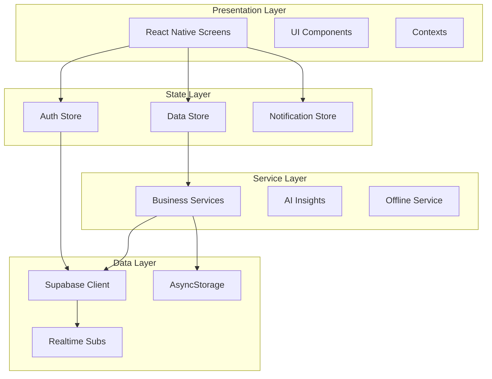

# Lkscale ERP 📱

> **Современная ERP-система для розничной торговли**
> 
> Управляйте бизнесом эффективно: склад, заказы, клиенты, финансы и аналитика в одном приложении.

[](https://expo.dev)
[](https://reactnative.dev)
[](https://www.typescriptlang.org)
[](https://supabase.com)

---

## 📋 Содержание

- [Описание проекта](#-описание-проекта)
- [Технологический стек](#-технологический-стек)
- [Возможности](#-возможности)
- [Быстрый старт](#-быстрый-старт)
- [Структура проекта](#-структура-проекта)
- [API Документация](#-api-документация)
- [Развертывание](#-развертывание)
- [Тестирование](#-тестирование)
- [Лицензия](#-лицензия)

---

## 🎯 Описание проекта

**Lkscale ERP** — это комплексное мобильное решение для автоматизации розничного бизнеса. Приложение предоставляет полный набор инструментов для управления:

- 📦 **Складской учет** — приемка, перемещение, списание, инвентаризация
- 🛒 **Заказы и продажи** — от создания до выполнения
- 👥 **CRM и лояльность** — база клиентов, программа лояльности
- 💰 **Финансы** — расходы, отчеты, налоговая отчетность
- 📊 **Аналитика** — AI-инсайты, прогнозы, KPI
- 🏪 **Мульти-магазин** — управление сетью торговых точек

### Архитектура приложения



---

## 🛠 Технологический стек

### Frontend
| Технология | Версия | Назначение |
|------------|--------|------------|
| React Native | 0.81.5 | Кроссплатформенная разработка |
| Expo SDK | 54 | Платформа разработки |
| Expo Router | 6 | File-based навигация |
| TypeScript | 5.9 | Типизация |
| React Native Reanimated | 4.1.1 | Анимации |

### Backend & Database
| Технология | Назначение |
|------------|------------|
| Supabase | PostgreSQL + Auth + Realtime |
| Supabase Storage | Хранение изображений |
| Edge Functions | Serverless функции |

### State Management
| Технология | Назначение |
|------------|------------|
| Custom Store (Pub/Sub) | Глобальное состояние |
| AsyncStorage | Локальное кэширование |
| React Context | Тема, локализация |

### AI & Analytics
| Сервис | Назначение |
|--------|------------|
| @fastshot/ai | AI-ассистент и инсайты |
| Custom Analytics | Бизнес-аналитика |

### DevOps
| Инструмент | Назначение |
|------------|------------|
| EAS Build | Сборка мобильных приложений |
| Vercel | Веб-развертывание |
| GitHub Actions | CI/CD |

---

## ✨ Возможности

### 📦 Управление товарами
- [x] Каталог товаров с категориями
- [x] SKU и штрих-коды
- [x] Множественные изображения
- [x] История цен и остатков
- [x] Минимальные остатки и алерты
- [x] Варианты товаров

### 🏪 Складские операции
- [x] Приемка товара
- [x] Перемещение между складами
- [x] Списание и возвраты
- [x] Корректировка остатков
- [x] Печать ценников
- [x] Прогнозы запасов

### 🛒 Заказы и продажи
- [x] Создание заказов
- [x] Статусы заказов
- [x] История заказов клиента
- [x] Способы оплаты
- [x] QR-коды заказов

### 👥 Клиенты и CRM
- [x] База клиентов
- [x] История покупок
- [x] Сегментация (VIP, Regular, New)
- [x] Примечания и теги
- [x] Средний чек и LTV

### 💰 Финансы
- [x] Учет расходов по категориям
- [x] Финансовая отчетность
- [x] Налоговые отчеты
- [x] P&L анализ
- [x] Экспорт в PDF/Excel

### 📊 Аналитика
- [x] KPI Dashboard
- [x] Графики продаж
- [x] AI-инсайты
- [x] Анализ трендов
- [x] Отчеты по сотрудникам

### 🏢 Enterprise
- [x] Мульти-магазин
- [x] Управление сотрудниками
- [x] Роли и права доступа
- [x] Аудит действий
- [x] Перемещения между точками

### 🎁 Лояльность
- [x] Программа лояльности
- [x] Купоны и скидки
- [x] Баллы клиентов
- [x] Персональные предложения

---

## 🚀 Быстрый старт

### Предварительные требования

- Node.js 18+
- npm или yarn
- Expo CLI: `npm install -g expo-cli`
- EAS CLI: `npm install -g eas-cli`

### 1. Клонирование и установка

```bash
# Клонирование репозитория
git clone https://github.com/your-org/lkscale-erp.git
cd lkscale-erp

# Установка зависимостей
npm install
```

### 2. Настройка окружения

```bash
# Копирование шаблона
cp .env.example .env

# Заполните переменные:
# EXPO_PUBLIC_SUPABASE_URL=https://your-project.supabase.co
# EXPO_PUBLIC_SUPABASE_ANON_KEY=your-anon-key
```

### 3. Запуск разработки

```bash
# Запуск на всех платформах
npx expo start

# Только iOS
npx expo start --ios

# Только Android
npx expo start --android

# Веб-версия
npx expo start --web
```

### 4. Сборка

```bash
# Development build
npm run build:dev

# Preview build
npm run build:preview

# Production build
npm run build:production
```

---

## 📁 Структура проекта

```
lkscale-erp/
├── app/                        # Expo Router screens
│   ├── (tabs)/                 # Bottom tabs navigation
│   │   ├── index.tsx           # Dashboard
│   │   ├── orders.tsx          # Orders list
│   │   ├── inventory.tsx       # Inventory management
│   │   ├── assistant.tsx       # AI Assistant
│   │   └── profile.tsx         # User profile
│   ├── auth/                   # Authentication
│   ├── cfo/                    # CFO Dashboard
│   ├── customers/              # CRM module
│   ├── executive/              # Executive reports
│   ├── finance/                # Financial management
│   ├── loyalty/                # Loyalty program
│   ├── marketing/              # Marketing analytics
│   ├── order/                  # Order management
│   ├── product/                # Product management
│   ├── reports/                # Reports
│   ├── security/               # Security & audit
│   ├── settings/               # App settings
│   ├── stores/                 # Multi-store management
│   ├── suppliers/              # Suppliers
│   ├── support/                # Support & FAQ
│   ├── team/                   # Team management
│   ├── telegram/               # Telegram integration
│   ├── warehouse/              # Warehouse operations
│   ├── login.tsx               # Login screen
│   ├── notifications.tsx       # Notifications center
│   └── paywall.tsx             # Subscriptions
├── components/                 # React components
│   ├── ui/                     # Base UI components
│   ├── charts/                 # Chart components
│   └── warehouse/              # Warehouse components
├── store/                      # State management
│   ├── authStore.ts            # Authentication state
│   ├── dataStore.ts            # Business data
│   ├── notificationStore.ts    # Notifications
│   ├── customers/              # Customer state
│   ├── orders/                 # Order state
│   ├── products/               # Product state
│   └── core/                   # Core utilities
├── services/                   # Business logic
│   ├── aiInsights.ts           # AI analytics
│   ├── analyticsService.ts     # Business analytics
│   ├── demoDataService.ts      # Demo data
│   ├── documentExportService.ts # Document export
│   ├── enterpriseService.ts    # Enterprise features
│   ├── offlineService.ts       # Offline mode
│   ├── securityService.ts      # Security
│   ├── storeSettingsService.ts # Store settings
│   └── warehouseService.ts     # Warehouse operations
├── lib/                        # Infrastructure
│   ├── supabase.ts             # Supabase client
│   └── supabaseDataService.ts  # Data operations
├── types/                      # TypeScript types
│   ├── index.ts                # Core types
│   ├── enterprise.ts           # Enterprise types
│   └── database.ts             # DB types
├── contexts/                   # React contexts
│   ├── OnboardingContext.tsx
│   ├── ThemeContext.tsx
│   └── LocalizationContext.tsx
├── localization/               # i18n
│   ├── translations.ts         # RU/EN translations
│   └── LocalizationContext.tsx
├── constants/                  # Constants
│   └── theme.ts                # Theme config
├── assets/                     # Static assets
│   ├── fonts/
│   └── images/
└── supabase/                   # Supabase config
    └── migrations/             # DB migrations
```

---

## 📚 API Документация

Подробная документация API доступна в [API.md](./API.md).

### Основные endpoints:

```typescript
// Products
fetchProducts()                    // GET /products
createProduct(data)               // POST /products
updateProduct(id, data)           // PATCH /products/:id
deleteProduct(id)                 // DELETE /products/:id

// Customers  
fetchCustomers()                   // GET /customers
createCustomer(data)              // POST /customers
updateCustomer(id, data)          // PATCH /customers/:id

// Orders
fetchOrders()                      // GET /orders
createOrder(data)                 // POST /orders
updateOrder(id, data)             // PATCH /orders/:id
```

---

## 🚀 Развертывание

### Веб-приложение (Vercel)

```bash
# Production deployment
npm run deploy:vercel

# Staging deployment  
npm run deploy:vercel:staging
```

### Мобильные приложения

```bash
# Android
npm run build:android

# iOS
npm run build:ios

# Submit to stores
npm run submit:android
npm run submit:ios
```

Подробнее в [DEPLOYMENT.md](./DEPLOYMENT.md).

---

## 🧪 Тестирование

### Тестовые аккаунты

| Роль | Email | Пароль |
|------|-------|--------|
| Admin | admin@demo.com | demo123 |
| Manager | manager@demo.com | demo123 |
| Cashier | cashier@demo.com | demo123 |

Подробное руководство по тестированию в [TESTING.md](./TESTING.md).

---

## 🧩 Скриншоты

```
┌─────────────────────┐  ┌─────────────────────┐  ┌─────────────────────┐
│    📊 Dashboard     │  │    📦 Inventory     │  │    🛒 Orders        │
│  ┌─────────────┐    │  │  ┌─────────────┐    │  │  ┌─────────────┐    │
│  │   KPI Cards │    │  │  │ Product Card│    │  │  │ Order List  │    │
│  ├─────────────┤    │  │  ├─────────────┤    │  │  ├─────────────┤    │
│  │ Sales Chart │    │  │  │ Categories  │    │  │  │ Status Badges│   │
│  ├─────────────┤    │  │  ├─────────────┤    │  │  ├─────────────┤    │
│  │ AI Insights │    │  │  │ Stock Level │    │  │  │ Quick Actions│   │
│  └─────────────┘    │  │  └─────────────┘    │  │  └─────────────┘    │
└─────────────────────┘  └─────────────────────┘  └─────────────────────┘
```

---

## 📝 Документация

- [API Reference](./API.md) — API endpoints и примеры
- [Testing Guide](./TESTING.md) — Руководство по тестированию
- [Deployment Guide](./DEPLOYMENT.md) — Инструкции по развертыванию
- [Codebase Index](./docs/CODEBASE_INDEX.md) — Индекс кодовой базы
- [Project Summary](./PROJECT_SUMMARY.md) — Итоги проекта
- [CI/CD Setup](./GITHUB_ACTIONS.md) — Настройка GitHub Actions

---

## 🤝 Участие в проекте

1. Fork репозитория
2. Создайте feature branch: `git checkout -b feature/amazing-feature`
3. Commit изменения: `git commit -m 'Add amazing feature'`
4. Push в branch: `git push origin feature/amazing-feature`
5. Откройте Pull Request

---

## 📄 Лицензия

Проект распространяется под лицензией MIT. См. [LICENSE](./LICENSE) для подробностей.

---

## 📞 Поддержка

- 📧 Email: support@lkscale.com
- 💬 Telegram: @lkscale_support
- 🌐 Website: https://lkscale.com

---

<p align="center">
  <strong>Made with ❤️ for retail business</strong>
</p>
